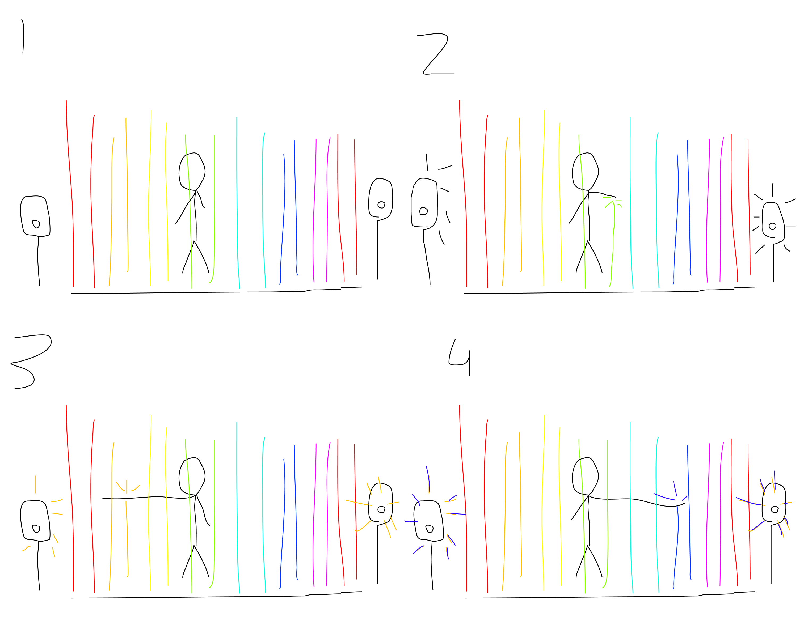

# Cercle Musical
## Idée
### Concept
Mon concept consiste en un système de lasers projetés du sol qui illuminent le plafond avec des couleurs variées. Lorsqu'une personne touche un laser, cela déclenche une note de musique, créant une expérience interactive et sonore. Ce dispositif mêle art visuel et sonorité, offrant une façon innovante de jouer avec la lumière et le son, idéal pour des événements festifs, des installations artistiques ou des espaces de loisirs.

### Objectifs
L'objectif est de fusionner l'interaction et la sonorité en créant une expérience où les participants deviennent des acteurs de leur environnement. Grâce à des lasers colorés projetés au sol, chaque geste déclenche une note musicale, transformant chaque interaction en une véritable composition vivante.
### Motivations
Passionné par la musique et la découverte des genres de manière interactive, j’ai été inspiré par Duetti: Mobili musicali pour créer une expérience immersive, combinant plaisir musical et technologie.

## Scénario
````mermaid
flowchart TD
    A[Interacteur] -->|met la main sur le laser| B{Sons_musique}
    B --> C[Effet]
    C --> D[Lumière]
    C --> E[Sons]
    D --> H{Fin Interaction}
    E --> H
    H --> |Oui|I[Veille]
    H --> |Non|B
````
En mode veille les lasers sont toujours actif, il n'y a juste pas de sons

## Scénarimage
#### Visualisation des séquences
Projection des lasers



## Synoptique
````mermaid
flowchart TD
    A[Ordinateur] --> B[Logiciel de son]
    B --> C[Carte de son] --> D[Haut-parleurs]
    A --> E[arduino] --> F[capteurs de lumières]
````

## Plantation

## Ambiance
### Planche d'ambiances visuelles
</img>

### Planche d'ambiances sonores

- [Jazz - Trompette](https://www.youtube.com/watch?v=US2uDbkiMPQ)
- [Rock - Guitare Électrique](https://www.youtube.com/watch?v=LTeW10EefKI)
- [Classique - Piano](https://www.youtube.com/watch?v=xejeEtdfgZY)


### Références artistiques
Duetti: Mobili Musicali, Parcours Musical Immersif

## Technologies
### Support médiatique
- Audio

### Matériel
- Capteur/Détecteur
- Clavier Midi
- Lumières LED
- Haut-Parleurs

### Logiciels
- Arduino
- Touch Designer
- Reaper
- Max
